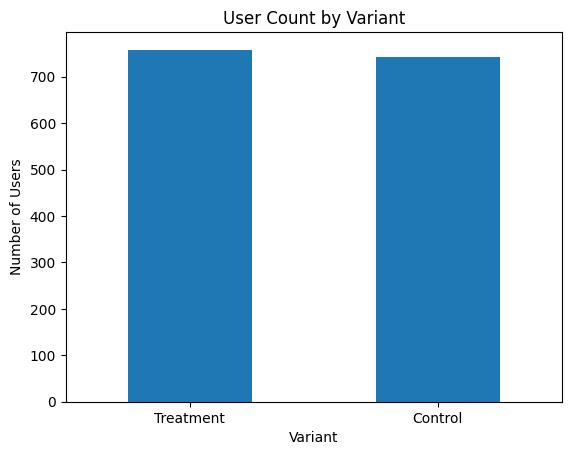
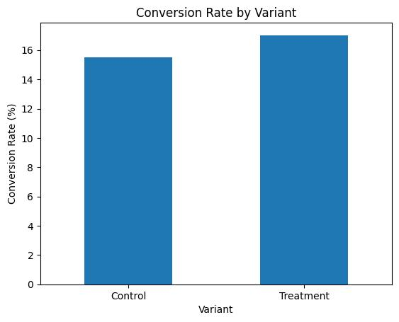
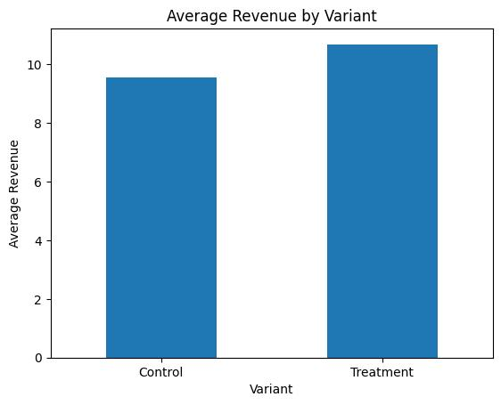
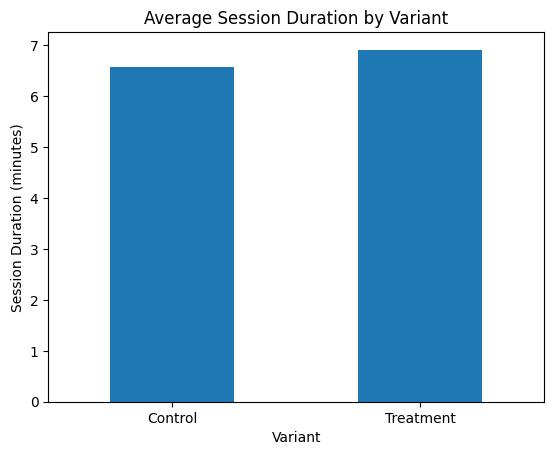

{\rtf1\ansi\ansicpg1252\cocoartf2758
\cocoatextscaling0\cocoaplatform0{\fonttbl\f0\fswiss\fcharset0 Helvetica;\f1\froman\fcharset0 Times-Bold;\f2\froman\fcharset0 Times-Roman;
\f3\fmodern\fcharset0 Courier;}
{\colortbl;\red255\green255\blue255;\red0\green0\blue0;}
{\*\expandedcolortbl;;\cssrgb\c0\c0\c0;}
{\*\listtable{\list\listtemplateid1\listhybrid{\listlevel\levelnfc23\levelnfcn23\leveljc0\leveljcn0\levelfollow0\levelstartat1\levelspace360\levelindent0{\*\levelmarker \{disc\}}{\leveltext\leveltemplateid1\'01\uc0\u8226 ;}{\levelnumbers;}\fi-360\li720\lin720 }{\listname ;}\listid1}
{\list\listtemplateid2\listhybrid{\listlevel\levelnfc23\levelnfcn23\leveljc0\leveljcn0\levelfollow0\levelstartat1\levelspace360\levelindent0{\*\levelmarker \{disc\}}{\leveltext\leveltemplateid101\'01\uc0\u8226 ;}{\levelnumbers;}\fi-360\li720\lin720 }{\listname ;}\listid2}
{\list\listtemplateid3\listhybrid{\listlevel\levelnfc23\levelnfcn23\leveljc0\leveljcn0\levelfollow0\levelstartat1\levelspace360\levelindent0{\*\levelmarker \{disc\}}{\leveltext\leveltemplateid201\'01\uc0\u8226 ;}{\levelnumbers;}\fi-360\li720\lin720 }{\listname ;}\listid3}
{\list\listtemplateid4\listhybrid{\listlevel\levelnfc23\levelnfcn23\leveljc0\leveljcn0\levelfollow0\levelstartat1\levelspace360\levelindent0{\*\levelmarker \{disc\}}{\leveltext\leveltemplateid301\'01\uc0\u8226 ;}{\levelnumbers;}\fi-360\li720\lin720 }{\listname ;}\listid4}
{\list\listtemplateid5\listhybrid{\listlevel\levelnfc23\levelnfcn23\leveljc0\leveljcn0\levelfollow0\levelstartat1\levelspace360\levelindent0{\*\levelmarker \{disc\}}{\leveltext\leveltemplateid401\'01\uc0\u8226 ;}{\levelnumbers;}\fi-360\li720\lin720 }{\listname ;}\listid5}
{\list\listtemplateid6\listhybrid{\listlevel\levelnfc23\levelnfcn23\leveljc0\leveljcn0\levelfollow0\levelstartat1\levelspace360\levelindent0{\*\levelmarker \{disc\}}{\leveltext\leveltemplateid501\'01\uc0\u8226 ;}{\levelnumbers;}\fi-360\li720\lin720 }{\listname ;}\listid6}
{\list\listtemplateid7\listhybrid{\listlevel\levelnfc23\levelnfcn23\leveljc0\leveljcn0\levelfollow0\levelstartat1\levelspace360\levelindent0{\*\levelmarker \{disc\}}{\leveltext\leveltemplateid601\'01\uc0\u8226 ;}{\levelnumbers;}\fi-360\li720\lin720 }{\listname ;}\listid7}
{\list\listtemplateid8\listhybrid{\listlevel\levelnfc23\levelnfcn23\leveljc0\leveljcn0\levelfollow0\levelstartat1\levelspace360\levelindent0{\*\levelmarker \{disc\}}{\leveltext\leveltemplateid701\'01\uc0\u8226 ;}{\levelnumbers;}\fi-360\li720\lin720 }{\listname ;}\listid8}
{\list\listtemplateid9\listhybrid{\listlevel\levelnfc23\levelnfcn23\leveljc0\leveljcn0\levelfollow0\levelstartat1\levelspace360\levelindent0{\*\levelmarker \{disc\}}{\leveltext\leveltemplateid801\'01\uc0\u8226 ;}{\levelnumbers;}\fi-360\li720\lin720 }{\listname ;}\listid9}
{\list\listtemplateid10\listhybrid{\listlevel\levelnfc23\levelnfcn23\leveljc0\leveljcn0\levelfollow0\levelstartat1\levelspace360\levelindent0{\*\levelmarker \{disc\}}{\leveltext\leveltemplateid901\'01\uc0\u8226 ;}{\levelnumbers;}\fi-360\li720\lin720 }{\listname ;}\listid10}}
{\*\listoverridetable{\listoverride\listid1\listoverridecount0\ls1}{\listoverride\listid2\listoverridecount0\ls2}{\listoverride\listid3\listoverridecount0\ls3}{\listoverride\listid4\listoverridecount0\ls4}{\listoverride\listid5\listoverridecount0\ls5}{\listoverride\listid6\listoverridecount0\ls6}{\listoverride\listid7\listoverridecount0\ls7}{\listoverride\listid8\listoverridecount0\ls8}{\listoverride\listid9\listoverridecount0\ls9}{\listoverride\listid10\listoverridecount0\ls10}}
\paperw11900\paperh16840\margl1440\margr1440\vieww11520\viewh8400\viewkind0
\pard\tx720\tx1440\tx2160\tx2880\tx3600\tx4320\tx5040\tx5760\tx6480\tx7200\tx7920\tx8640\pardirnatural\partightenfactor0

\f0\fs24 \cf0 # A/B Testing & Product Analytics\
\
## Project Overview\
\
This project analyzes an A/B test experiment to compare the performance of a Control and Treatment variant. The workflow includes data cleaning, exploratory data analysis (EDA), statistical testing, and interpretation of business metrics to support data-driven product decisions.\
\
## Objectives\
\
- Clean and prepare experiment data for analysis\
- Compare Control and Treatment groups across key product metrics\
- Analyze user behavior and engagement patterns\
- Apply statistical testing to evaluate experiment results\
- Translate findings into business recommendations\
\
## Dataset\
\
The dataset includes:\
\
- user_id\
- date\
- variant\
- device_type\
- country\
- new_user\
- session_duration_min\
- pages_viewed\
- added_to_cart\
- purchase\
- revenue\
\
## Data Cleaning\
\
The following preprocessing steps were applied:\
\
- Removed duplicate rows\
- Filled missing values in device_type using the mode\
- Filled missing values in session_duration_min and pages_viewed using median values\
- Standardized inconsistent text values in variant, device_type, country, and new_user\
- Corrected invalid negative values in session_duration_min and pages_viewed\
- Converted date to datetime format\
\
## Exploratory Data Analysis\
\
The analysis focused on:\
\
- User count by variant\
- Conversion rate by variant\
- Average revenue by variant\
- Average session duration by variant\
- User behavior patterns across experiment groups\
\
## Statistical Testing\
\
Statistical tests were used to evaluate whether observed differences between variants were significant:\
\
- Chi-square test for conversion\
- Independent t-test for revenue\
- Independent t-test for session duration\
\
## Results\
\
- Control conversion rate: 15.50%\
- Treatment conversion rate: 17.02%\
- Control average revenue: 9.56\
- Treatment average revenue: 10.69\
- Control average session duration: 6.57 minutes\
- Treatment average session duration: 6.91 minutes\
\
Statistical test results:\
\
- Conversion p-value: 0.4670\
- Revenue p-value: 0.4193\
- Session duration p-value: 0.0009\
\
## Conclusion\
\
The Treatment variant performed slightly better across several metrics, but only session duration showed a statistically significant improvement. This suggests that the experiment had a positive effect on user engagement, while its impact on conversion and revenue remains inconclusive.\
\
## Visualizations\
\
### User Count by Variant\
\
\
### Conversion Rate by Variant\
\
\
### Average Revenue by Variant\
\
\
### Average Session Duration by Variant\
\
\
## Project Structure\
\
```bash\
ab-testing-product-analytics/\
\uc0\u9474 \
\uc0\u9500 \u9472 \u9472  data/\
\uc0\u9474    \u9500 \u9472 \u9472  raw/\
\uc0\u9474    \u9474    \u9492 \u9472 \u9472  ab_testing_product_analytics_raw.csv\
\uc0\u9474    \u9492 \u9472 \u9472  processed/\
\uc0\u9474        \u9492 \u9472 \u9472  ab_testing_product_analytics_cleaned.csv\
\uc0\u9500 \u9472 \u9472  images/\
\uc0\u9500 \u9472 \u9472  README.md\
\uc0\u9492 \u9472 \u9472  requirements.txt\
\pard\tx720\tx1440\tx2160\tx2880\tx3600\tx4320\tx5040\tx5760\tx6480\tx7200\tx7920\tx8640\pardirnatural\partightenfactor0
\cf0 ```\

\f1\b\fs36 \expnd0\expndtw0\kerning0
\outl0\strokewidth0 \strokec2 Tools and Libraries\
\pard\tx220\tx720\pardeftab720\li720\fi-720\partightenfactor0
\ls1\ilvl0
\f2\b0\fs24 \cf0 \kerning1\expnd0\expndtw0 \outl0\strokewidth0 {\listtext	\uc0\u8226 	}\expnd0\expndtw0\kerning0
\outl0\strokewidth0 \strokec2 Python\
\pard\tx220\tx720\pardeftab720\li720\fi-720\partightenfactor0
\ls2\ilvl0\cf0 \kerning1\expnd0\expndtw0 \outl0\strokewidth0 {\listtext	\uc0\u8226 	}\expnd0\expndtw0\kerning0
\outl0\strokewidth0 \strokec2 pandas\
\pard\tx220\tx720\pardeftab720\li720\fi-720\partightenfactor0
\ls3\ilvl0\cf0 \kerning1\expnd0\expndtw0 \outl0\strokewidth0 {\listtext	\uc0\u8226 	}\expnd0\expndtw0\kerning0
\outl0\strokewidth0 \strokec2 numpy\
\pard\tx220\tx720\pardeftab720\li720\fi-720\partightenfactor0
\ls4\ilvl0\cf0 \kerning1\expnd0\expndtw0 \outl0\strokewidth0 {\listtext	\uc0\u8226 	}\expnd0\expndtw0\kerning0
\outl0\strokewidth0 \strokec2 matplotlib\
\pard\tx220\tx720\pardeftab720\li720\fi-720\partightenfactor0
\ls5\ilvl0\cf0 \kerning1\expnd0\expndtw0 \outl0\strokewidth0 {\listtext	\uc0\u8226 	}\expnd0\expndtw0\kerning0
\outl0\strokewidth0 \strokec2 scipy\
\pard\tx220\tx720\pardeftab720\li720\fi-720\partightenfactor0
\ls6\ilvl0\cf0 \kerning1\expnd0\expndtw0 \outl0\strokewidth0 {\listtext	\uc0\u8226 	}\expnd0\expndtw0\kerning0
\outl0\strokewidth0 \strokec2 scikit-learn\
\pard\tx720\pardeftab720\partightenfactor0
\cf0 \
\
\pard\pardeftab720\sa298\partightenfactor0

\f1\b\fs36 \cf0 Key Insight\
\pard\pardeftab720\sa240\partightenfactor0

\f2\b0\fs24 \cf0 \strokec2 Although the Treatment group showed slightly higher conversion and revenue, these differences were not statistically significant. The only clear experimental impact was improved session duration, indicating stronger engagement rather than confirmed business uplift.\
\pard\pardeftab720\sa298\partightenfactor0

\f1\b\fs36 \cf0 \strokec2 Future Improvements\
\pard\tx220\tx720\pardeftab720\li720\fi-720\partightenfactor0
\ls7\ilvl0
\f2\b0\fs24 \cf0 \kerning1\expnd0\expndtw0 \outl0\strokewidth0 {\listtext	\uc0\u8226 	}\expnd0\expndtw0\kerning0
\outl0\strokewidth0 \strokec2 Test the experiment on a larger sample\
\pard\tx220\tx720\pardeftab720\li720\fi-720\partightenfactor0
\ls8\ilvl0\cf0 \kerning1\expnd0\expndtw0 \outl0\strokewidth0 {\listtext	\uc0\u8226 	}\expnd0\expndtw0\kerning0
\outl0\strokewidth0 \strokec2 Segment results by device type, country, or user type\
\pard\tx220\tx720\pardeftab720\li720\fi-720\partightenfactor0
\ls9\ilvl0\cf0 \kerning1\expnd0\expndtw0 \outl0\strokewidth0 {\listtext	\uc0\u8226 	}\expnd0\expndtw0\kerning0
\outl0\strokewidth0 \strokec2 Add more product metrics such as add-to-cart rate\
\pard\tx220\tx720\pardeftab720\li720\fi-720\partightenfactor0
\ls10\ilvl0\cf0 \kerning1\expnd0\expndtw0 \outl0\strokewidth0 {\listtext	\uc0\u8226 	}\expnd0\expndtw0\kerning0
\outl0\strokewidth0 \strokec2 Explore confidence intervals and effect sizes for deeper interpretation\
\pard\tx720\pardeftab720\partightenfactor0
\cf0 \
\
\pard\pardeftab720\sa298\partightenfactor0

\f1\b\fs36 \cf0 \strokec2 Author\
\pard\pardeftab720\sa240\partightenfactor0

\f2\b0\fs24 \cf0 \strokec2 Na\uc0\u273 a Radoji\u269 i\u263 \
\pard\pardeftab720\partightenfactor0

\f3\fs26 \cf0 \
\
\pard\tx720\pardeftab720\partightenfactor0

\f2\fs24 \cf0 \strokec2 \
\pard\pardeftab720\sa298\partightenfactor0

\f1\b\fs36 \cf0 \
}